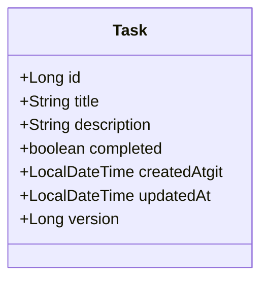

## 領域模型 (Domain Model)

專案領域核心為 `Task` 實體，架構如下：



### 領域模型欄位說明

| 欄位名稱 | 型態 | 說明 |
| :--- | :--- | :--- |
| `id` | `Long` | 任務唯一識別碼（Primary Key, Auto-Increment） |
| `title` | `String` | 任務標題（必填，上限 255 字元） |
| `description` | `String` | 任務詳細說明（選填，TEXT） |
| `completed` | `boolean` | 完成狀態（`true`: 已完成, `false`: 未完成，預設 `false`） |
| `createdAt` | `LocalDateTime` | 建立時間（自動產生） |
| `updatedAt` | `LocalDateTime` | 最後更新時間（自動產生） |
| `version` | `Long` | 樂觀鎖版本號（使用 JPA `@Version` 自動維護） |

### 樂觀鎖（Optimistic Locking）控制機制

1. **版本欄位**：`Task` 實體包含 `@Version private Long version`。
2. **衝突檢測**：後端在更新 (`PUT /api/v1/tasks/{id}`) 時比較請求傳入的 `version` 與資料庫現有版本。
3. **HTTP 狀態碼**：若版本不一致，後端拋出 `OptimisticLockingFailureException` 並回傳 `HTTP 409 Conflict`。
4. **前端處理**：前端收到 HTTP 409 時跳出提示訊息並自動重新載入最新資料清單。

---

## OpenAPI 規格存取說明

本專案使用 **OpenAPI 3.0.3** 定義完整的 RESTful API 規格。

### 1. 本地 OpenAPI 規格檔案

* **規格檔案位置**：專案根目錄下的 [`openapi.yaml`](./openapi.yaml)
* 包含了所有的 API 路徑、請求與回應型態、JSON Schema 範例以及錯誤回應格式。

### 2. 線上或 IDE 查看方式

* **Swagger Editor / ReDoc**：可將 [`openapi.yaml`](./openapi.yaml) 複製或匯入至 [Swagger Editor](https://editor.swagger.io/) 在線預覽與測試。
* **VS Code 擴充套件**：可安裝 `OpenAPI (Swagger) Editor` 套件並點擊 `Preview Swagger` 查看。

---

## REST API 端點列表

| HTTP 方法 | 端點 (Endpoint) | 功能說明 | 成功狀態碼 |
| :--- | :--- | :--- | :--- |
| `GET` | `/api/v1/tasks` | 查詢任務列表 (支援 `completed` 篩選) | `200 OK` |
| `POST` | `/api/v1/tasks` | 建立新任務 | `201 Created` |
| `GET` | `/api/v1/tasks/{id}` | 查詢單一任務詳細資訊 | `200 OK` |
| `PUT` | `/api/v1/tasks/{id}` | 更新任務內容與完成狀態 (含樂觀鎖驗證) | `200 OK` |
| `DELETE` | `/api/v1/tasks/{id}` | 刪除指定任務 | `204 No Content` |

---

## 本地開發與啟動步驟

### 前置需求
- **JDK 17** 或以上
- **Node.js 18+** 及 **npm**

### 1. 啟動後端服務 (Spring Boot)

```bash
cd backend
./gradlew bootRun
```
* 後端服務啟動於 `http://localhost:8080`
* 預設使用 H2 InMemory 資料庫，啟動時透過 `data.sql` 自動載入測試初始資料。

#### 執行後端測試：
```bash
cd backend
./gradlew test
```

### 2. 啟動前端開發伺服器 (Vue 3)

```bash
cd frontend
npm install
npm run dev
```
* 前端服務啟動於 `http://localhost:5173`

#### 執行前端型別檢查與打包生產版本：
```bash
cd frontend
npm run build
```
